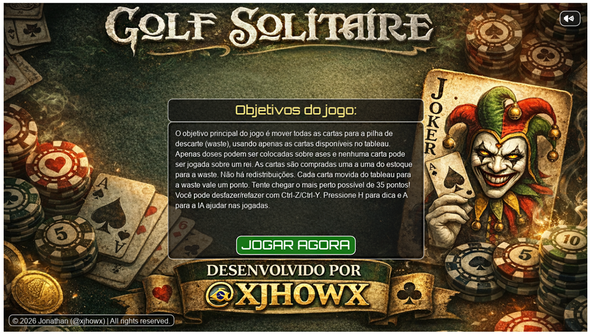
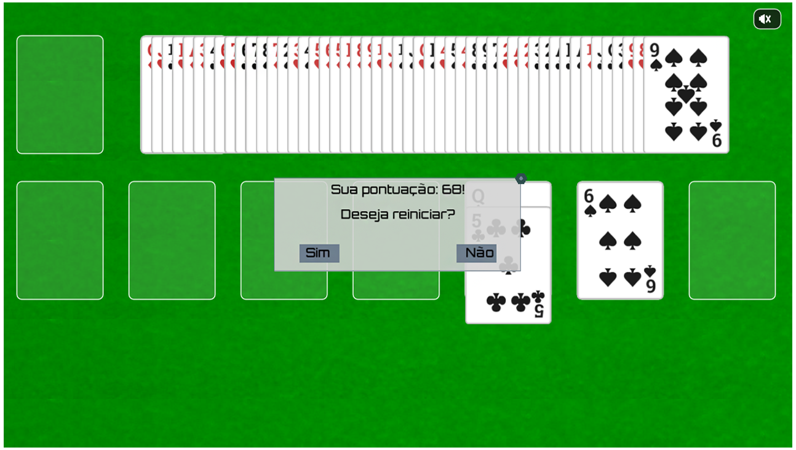

# Golf Solitaire

[](https://github.com/lab-xjhowx/Golf-Solitaire/actions/workflows/ci.yml)
[](https://www.lua.org/)

Golf Solitaire em 2D feito com LÖVE (Love2D). Inclui undo/redo, hints e IA simples. Compatível com LÖVE 11.x.

2D Golf Solitaire built with LÖVE (Love2D). Includes undo/redo, hints, and a simple move-suggestion AI. Compatible with LÖVE 11.x.

## Visão geral

Este projeto implementa Golf Solitaire com foco em arquitetura modular, UX clara e base sólida para evolução. O fluxo é guiado por estados, com sistemas de regras, score, input e animação isolados e coordenados por um GameContext centralizado.

## Screenshots





## Como jogar

- Mova cartas do tableau para a waste usando valores adjacentes.
- Compre cartas do deck quando não houver jogadas disponíveis.
- O objetivo é limpar todas as pilhas e maximizar a pontuação.

## Controles

- Mouse — selecionar, arrastar e soltar cartas
- H — dica de jogada
- A — ativa IA para sugerir jogadas
- Ctrl + Z — desfaz o último movimento
- Ctrl + Y — refaz o movimento desfeito
- M — alterna música
- E — alterna modo endless
- R — inicia replay por snapshots
- Esc — sair do jogo

## Arquitetura

- Core: callbacks do LÖVE e bootstrap em main.lua e dependencies.lua
- States: menu, jogo e prompt
- Systems: regras, score, input, animação
- Entities: Card, Deck, Pile, Waste, DraggingCard
- UI: telas e elementos de interação
- Resources: sprites, fontes, áudio

Detalhes técnicos: docs/ARQUITETURA.md

## Documentação

- [ARQUITETURA.md](docs/ARQUITETURA.md)
- [REGRAS_DO_JOGO.md](docs/REGRAS_DO_JOGO.md)
- [NOTAS_PTBR.md](NOTAS_PTBR.md)
- [ROADMAP.md](ROADMAP.md)
- [ROADMAP_GOLF_SOLITAIRE.md](ROADMAP_GOLF_SOLITAIRE.md)
- [auditoria_tecnica_golf_solitaire_love_2_d.md](auditoria_tecnica_golf_solitaire_love_2_d.md)
- [auditoria_estrategica_roadmap_profissional_golf_solitaire.md](auditoria_estrategica_roadmap_profissional_golf_solitaire.md)

## Estrutura de pastas

- assets/ — imagens, fontes e áudio
- docs/ — documentação técnica
- lib/ — bibliotecas auxiliares
- src/ — lógica do jogo, estados, objetos, sistemas
- screenshots/ — capturas de tela
- tests/ — testes de regras e score

## Tecnologias usadas

- Lua
- LÖVE (Love2D)
- Bibliotecas em lib/: class, autocursor, lovecc, itable

## Como rodar localmente

Pré-requisitos: LÖVE (Love2D) 11.x instalado.

```bash
git clone <url-do-repositorio>
cd golf-master
love .
```

No Windows, se o love não estiver no PATH:

```powershell
& "C:\Program Files\LOVE\love.exe" .
```

## Testes

```bash
lua tests/rules_score_tests.lua
```

## English

Short overview: Golf Solitaire in LÖVE (Love2D) with undo/redo, hints and a simple AI helper. Compatible with LÖVE 11.x.

Run:

```bash
git clone <url-do-repositorio>
cd golf-master
love .
```

Windows (if Love2D is not in PATH):

```powershell
& "C:\Program Files\LOVE\love.exe" .
```

Tests:

```bash
lua tests/rules_score_tests.lua
```

## Roadmap

Veja o arquivo ROADMAP.md para evolução técnica, features e polimento visual.

## Créditos

- Jonathan (@xjhowx)
- Fontes: Ostrich Sans (The League of Moveable Type)
- SFX: Casino Audio Pack (Kenney)

## Licença

Sem licença declarada no repositório.
